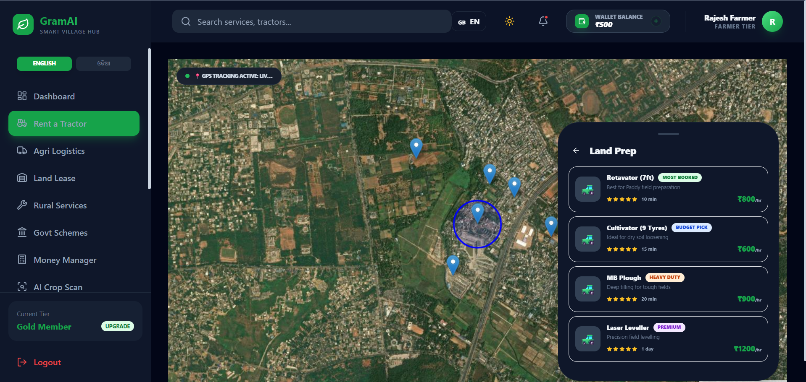
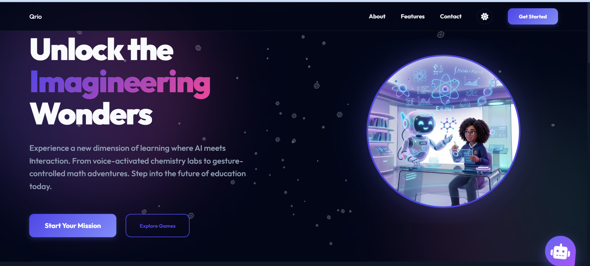
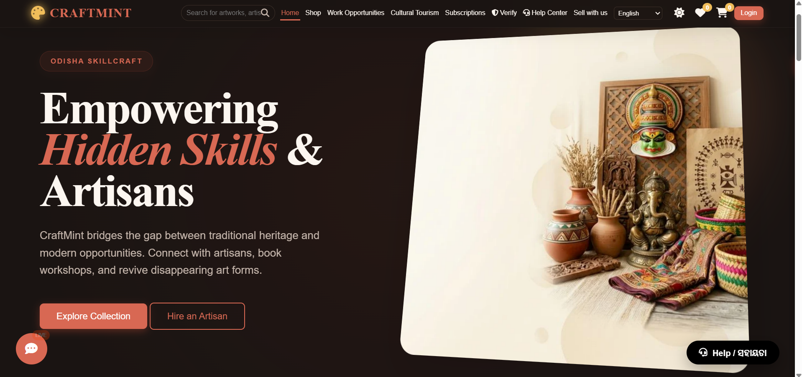

<h1 align="center">Hi 👋, I'm Jitendra Nial</h1>

<h3 align="center">
🚀 Full Stack Developer (MERN) | Java Developer | AI Builder
</h3>

<p align="center">

</p>

---

# 🧑‍💻 About Me

🎓 B.Tech CSE Student at Bhubaneswar Engineering College (BPUT)  
💻 Passionate Full Stack Developer focused on MERN, Java & AI  
🚀 Building startup-level platforms & production-ready web apps  
🏆 Multiple Hackathon Winner & Finalist  
🧠 Exploring scalable systems, AI integrations & modern UI/UX  
📍 Odisha, India

---

# 🚀 Tech Stack

## 💻 Languages

<p>

</p>

## 🎨 Frontend

<p>

</p>

## ⚙️ Backend

<p>

</p>

## 🗄 Database

<p>

</p>

## 🛠 Tools

<p>

</p>

---

# 🌟 Featured Projects

---

## 🌾 GramAI — Smart Village AI Platform

AI-powered rural ecosystem supporting farmers & villages through digital services.

### ✨ Features

- 🚜 Rent-a-Tractor
- 📦 Agri Logistics
- 🏛 Govt Schemes
- 🌱 Farming Solutions
- 📊 Money Manager
- 🤖 AI Crop Scan
- 🛒 Agri Market

🌐 Live Demo:  
https://grammy-uuu7.onrender.com

<p align="center">
  
</p>

---

## 🤖 QRIO — Gamified AI Learning Platform

Interactive AI-powered educational platform with futuristic learning experiences.

### ✨ Features

- 🎮 Gamified Missions
- 🎙 Voice Interaction
- ✋ Gesture Learning
- 🧠 AI Learning Modules
- 🏆 Rewards & Leaderboards

🌐 Live Demo:  
https://qrio-g413.onrender.com/

<p align="center">
  
</p>

---

## 🏥 MedGo — Healthcare at Your Doorstep

Modern healthcare booking & clinical assistance platform.

### ✨ Features

- 🩺 Book Doctors
- 🚑 Clinical Response
- 🏠 Home Healthcare
- 📅 Appointment System

🌐 Live Demo:  
https://medgo-1.onrender.com/

<p align="center">
  
</p>

---

## 🎨 CraftMint — Odisha Skillcraft Marketplace

Traditional artisan marketplace empowering local creators & handmade businesses.

### ✨ Features

- 🛍 Product Marketplace
- 👨‍🎨 Hire Artisan
- 🖼 Art Categories
- 📱 Responsive UI

🌐 Live Demo:  
https://craft-473e.onrender.com

<p align="center">
  
</p>

---

# 🏆 Achievements

🥇 Winner — BPUT Hackathon  
🥇 Winner — Centurion Agastya Hackathon  
🥈 Runner-Up — KIIT Hackathon  
🏅 Finalist — NIT Rourkela Hackathon  
🏅 Finalist — GDG Bhubaneswar HackFest  
🏅 Top 3 — IIIT Bhubaneswar Hackathon  
🔥 Participated in 20+ Hackathons

---

# 💼 Experience

## SEO Intern — SEOCZAR, Bhubaneswar

- Technical SEO
- Keyword Research
- Website Optimization
- Digital Growth

---

# 📚 Workshops

🤖 AI & Machine Learning Workshop  
📍 IIT Bhubaneswar

---

# 📊 GitHub Stats

<p align="center">

</p>

<p align="center">

</p>

<p align="center">

</p>

---

# 🌐 Connect With Me

<p align="left">

<a href="mailto:mununial637@gmail.com">

</a>

<a href="https://github.com/Mununial">

</a>

<a href="https://www.instagram.com/munu_nial">

</a>

</p>

---

# 🐍 Contribution Snake

<p align="center">
  
</p>

---

# ⚡ Fun Fact

```javascript
while(!success){


   learn();
   build();
   improve();
}
